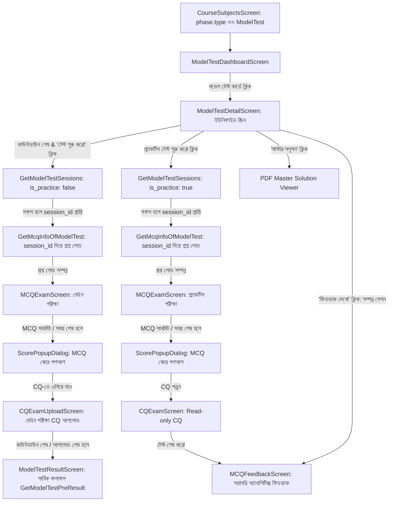

# Final Implementation Plan: মডেল টেস্ট (Model Test) ফিচার - চূড়ান্ত ব্লুপ্রিন্ট

চ্যাপ্টার এক্সাম (Chapter Exam) থেকে সম্পূর্ণ আলাদা এবং বিচ্ছিন্ন (isolated) একটি আর্কিটেকচারে **মডেল টেস্ট (Model Test)** ফিচারটি বাস্তবায়ন করা হবে। এটি একটি ডেডিকেটেড প্যাকেজে (`com.example.modeltest`) নিজস্ব Repository, ViewModel, UI Components, Room Local Cache ও Data Models সহ তৈরি হবে।

---

## ১. আর্কিটেকচার ও প্যাকেজ কাঠামো (Clean Architecture)

```
app/src/main/java/com/example/modeltest/
├── data/
│   ├── ModelTestModels.kt            # সব GraphQL Models & Domain Enums
│   ├── ModelTestRepository.kt        # api.shikho.com & analytics.shikho.com এর API Calls
│   └── local/
│       ├── ModelTestDao.kt           # অফলাইন MCQ উত্তর ও সেশন/টাইমার স্টেট Room DAO
│       ├── OfflineMcqAnswerEntity.kt # অফলাইন উত্তরের Room Entity
│       ├── ExamSessionStateEntity.kt # লাইফসাইকেল রিস্টোরের জন্য সেশন ও টাইমার Entity
│       └── ModelTestDatabase.kt      # অফলাইন সিঙ্ক ও স্টেট ব্যাকআপ ডাটাবেজ
├── ui/
│   ├── ModelTestViewModel.kt         # সেন্ট্রালাইজড স্টেট ও টাইমার ম্যানেজমেন্ট
│   ├── ModelTestViewModelFactory.kt  # ভিউমডেল ফ্যাক্টরি
│   ├── screens/
│   │   ├── ModelTestDashboardScreen.kt # মডেল টেস্ট ও লাইভ ক্লাসের তালিকা
│   │   ├── ModelTestDetailScreen.kt    # ইউনিফাইড স্ক্রিন: কাউন্টডাউন, রুলস, কার্ড ও প্র্যাকটিস সেকশন
│   │   ├── MCQExamScreen.kt            # MCQ টেস্ট, প্যালেট, টাইমার, লাইফসাইকেল লিসনার ও ব্যাক গার্ড
│   │   ├── CQExamScreen.kt             # প্র্যাকটিস CQ (Read-only) + মাস্টার সলুশন লিংক
│   │   ├── CQExamUploadScreen.kt       # মেইন এক্সাম CQ ইমেজ আপলোড স্ক্রিন (কাউন্টডাউন টাইমারসহ)
│   │   ├── ModelTestResultScreen.kt    # মেইন পরীক্ষার সার্বিক ফলাফল (MCQ + CQ মিলিত স্কোর)
│   │   └── MCQFeedbackScreen.kt        # প্রশ্নভিত্তিক সঠিক/ভুল ব্যাখ্যা, ফিল্টার ড্রপডাউন ও এরর ফলব্যাক
│   └── components/
│       ├── ModelTestCountdownTimer.kt # লাইভ কাউন্টডাউন কম্পোনেন্ট (বাংলা ডিজিটে দিন, ঘণ্টা, মিনিট, সেকেন্ড)
│       ├── QuestionPaletteSheet.kt   # 'সবগুলো দেখো' প্রশ্ন গ্রিড ভিউ (সবুজ, সাদা, নীল)
│       ├── ExitExamDialog.kt         # ব্যাক বাটন কনফার্মেশন গার্ড
│       ├── ScorePopupDialog.kt       # MCQ সাবমিটের পর প্রাপ্ত নম্বরের পপআপ
│       ├── ModelTestShimmer.kt       # আধুনিক শিমার/স্কেলিটন লোডার
│       └── RetryErrorView.kt         # API ফেইলিউরের ক্ষেত্রে এরর স্টেট ও আবার চেষ্টা বাটন
```

---

## ২. কোর্স ডিটেকশন ও এন্ট্রি পয়েন্ট লজিক (Course Detection)

- **চেক লজিক:** `CourseSubjectsScreen.kt`-এ যখন ইউজার কোনো সাবজেক্টে ক্লিক করে:
  - `phase.type == "ModelTest"` হলে ➡️ `ModelTestDashboardScreen`-এ নেভিগেট করবে।
  - `phase.type == "Default"` হলে ➡️ বিদ্যমান চ্যাপ্টার এক্সাম/কোর্স স্ক্রিনে যাবে।
- চ্যাপ্টার এক্সামের বিদ্যমান কোনো ফাইলে বা লজিকে কোনো পরিবর্তন আনা হবে না।

---

## ৩. সম্পূর্ণ ইউজার ফ্লো ও সেশন ক্রিয়েশন (Mermaid Architecture)



---

## ৪. স্ক্রিনভিত্তিক বিস্তারিত ফিচার ও লজিক

### ১. মডেল টেস্ট ড্যাশবোর্ড (`ModelTestDashboardScreen`)
- **শিমার লোডার:** ডেটা লোডিংয়ের সময় কার্ড স্কেলিটন শিমার এনিমেশন প্রদর্শিত হবে।
- **ট্যাব ১ - "মডেল টেস্ট":** `SubjectSpecificModelTestsOrLiveClass(content_type: "ModelTest")` দিয়ে তালিকা।
  - টাইটেল, বাংলা ফরম্যাটে তারিখ ও সময়।
  - স্ট্যাটাস ব্যাজ: মিসড 🔴, সম্পন্ন 🟢, আসন্ন 🔵।
- **ট্যাব ২ - "ক্লাস":** লাইভ ও লেকচার ক্লাসের তালিকা। কার্ডে ক্লিক করলে লাইভ ক্লাস প্লেয়ার বা রেকর্ডেড প্লেয়ারে নেভিগেট করবে।
- নিচে `"হোম এ ফিরে যাও"` বাটন থাকবে।

### ২. ইউনিফাইড ডিটেইল ও রুলস স্ক্রিন (`ModelTestDetailScreen`)
সব তথ্য একটি মসৃণ স্ক্রল ভিউতে থাকবে:
- **কাউন্টডাউন টাইমার ও বাটন স্ট্যাটাস:**
  - **আসন্ন পরীক্ষা (Upcoming):** লাইভ কাউন্টডাউন টাইমার চলবে বাংলা সংখ্যায় (যেমন: `০২ দিন ০৪ ঘন্টা ১২ মিনিট ৩০ সেকেন্ড`)। "টেস্ট শুরু করো" বাটনটি Disabled থাকবে। টাইমার ০ হলে স্বয়ংক্রিয়ভাবে সক্রিয় হবে।
  - **মিস হওয়া পরীক্ষা (Missed):** যদি পরীক্ষার নির্ধারিত সময় পার হয়ে যায়, তবে টাইমারের জায়গায় লেখা থাকবে `"সময় শেষ"`। "টেস্ট শুরু করো" বাটনটি স্থায়ীভাবে Disabled/Hidden থাকবে এবং সেখানে লাল ব্যাজে লেখা থাকবে `"পরীক্ষা মিস হয়েছে"`।
- **পরীক্ষার নিয়মাবলী কার্ড:** ইন্টারনেট কানেকশন, MCQ ও CQ-এর নম্বর বণ্টন, শুধুমাত্র একবার দেওয়া যাবে ইত্যাদি নিয়মাবলি।
- **MCQ ও CQ ইনফো কার্ড:** মোট প্রশ্ন ও নির্ধারিত সময়। নিচে `"মাস্টার সলুশন"` বাটন থাকবে (উপলব্ধ থাকলে)।
- **ডাইনামিক প্র্যাকটিস সেকশন:**
  - **মিসড পরীক্ষায় প্র্যাকটিস সুবিধা:** পরীক্ষা মিস হলেও ইউজার সবসময় প্র্যাকটিস টেস্ট দিতে পারবে!
  - **ডাইনামিক লিমিট টেক্সট:** API রেসপন্সের ওপর ভিত্তি করে হিসাব হবে:
    - ইউজার কিছু টেস্ট দিয়ে থাকলে: `"আর মাত্র X বার প্র্যাকটিস টেস্ট দিতে পারবে"` (বাংলা ডিজিটে)।
    - কোনো টেস্ট না দিয়ে থাকলে: `"সর্বমোট Y বার প্র্যাকটিস টেস্ট দিতে পারবে"` (বাংলা ডিজিটে)।
    - লিমিট শূন্য হয়ে গেলে: `"প্র্যাকটিস টেস্ট শুরু করো"` বাটনটি Disabled হবে এবং উপরে লাল সতর্কবার্তা আসবে: `"তোমার প্র্যাকটিস টেস্টের লিমিট শেষ হয়ে গেছে!"`।
  - **ডাইনামিক প্র্যাকটিস সেশন লিস্ট:**
    - ইউজার কোনো প্র্যাকটিস না দিলে কেবল শুরুর বাটন থাকবে।
    - ১ বা তার বেশি প্র্যাকটিস দিলে প্রতিটির জন্য আলাদা কার্ড আসবে (প্র্যাকটিস টেস্ট ১, প্র্যাকটিস টেস্ট ২...)।
    - **ফিডব্যাক বাটনের স্ট্যাটাস:** শুধুমাত্র সম্পন্ন হওয়া (`is_completed`) সেশনের কার্ডেই `"ফিডব্যাক দেখো"` বাটন দৃশ্যমান ও সক্রিয় থাকবে।

### ৩. সেশন ক্রিয়েশন ও MCQ পরীক্ষা স্ক্রিন (`MCQExamScreen`)
- **সেশন ক্রিয়েশন ধাপ:**
  1. ইউজার "টেস্ট শুরু করো" বা "প্র্যাকটিস টেস্ট শুরু করো" বাটনে ক্লিক করলে স্ক্রিনে একটি স্টাইলিশ লোডার আসবে।
  2. মেইন পরীক্ষার জন্য `GetModelTestSessions(modelTestId, is_practice: false)` কল হবে।
  3. প্র্যাকটিস পরীক্ষার জন্য `GetModelTestSessions(modelTestId, is_practice: true)` কল হবে।
  4. প্রাপ্ত `session_id` দিয়ে `GetMcqInfoOfModelTest(session_id)` কল করে সব প্রশ্ন ও অপশন লোড করার পরই `MCQExamScreen` প্রদর্শিত হবে।
- **অ্যাপ লাইফসাইকেল হ্যান্ডলিং (onPause / onStop):**
  - পরীক্ষা চলাকালীন ইউজার যদি হোম প্রেস করে, ফোন লক করে বা কোনো কল আসে, `DisposableEffect` বা `LifecycleEventEffect` দিয়ে `onPause`/`onStop` ইভেন্টে বর্তমান অবশিষ্ট সেকেন্ড, বর্তমান প্রশ্ন ইনডেক্স এবং ব্যবহারকারীর নির্বাচিত উত্তরসমূহ `ExamSessionStateEntity`-র মাধ্যমে Room DB-তে সংরক্ষণ করা হবে।
  - ইউজার অ্যাপে ফিরে এলে (`onResume`) ডাটাবেজ থেকে স্টেট রিস্টোর করে যেখান থেকে থামিয়েছিল সেখান থেকেই পরীক্ষা চালু হবে।
- **হেডার ও টাইমার:** লাইভ টাইমার (যেমন: `২৯:৫৯` বাংলা সংখ্যায় কমতে থাকবে) এবং প্রগ্রেস বার (`১/৩০`)।
- **প্রশ্ন ও অপশন:** বাংলা ফরম্যাটে প্রশ্ন ও ৪টি অপশন।
- **প্রশ্ন প্যালেট বটমশিট ('সবগুলো দেখো'):**
  - 🟢 সবুজ = উত্তর দেওয়া হয়েছে
  - ⚪ সাদা = উত্তর দেওয়া হয়নি
  - 🔵 নীল = বর্তমান নির্বাচিত প্রশ্ন
- **অটো-সেভ & অফলাইন রুম ব্যাকআপ:**
  - প্রতিটি অপশন ক্লিকের সাথে সাথে ব্যাকগ্রাউন্ডে `SubmitMcqOfModelQuestion(is_final_submitted: false)` কল হবে।
  - ইন্টারনেট বিঘ্নিত হলে Room Database-এ `OfflineMcqAnswerEntity` তে স্টোর হবে এবং পুনরায় কানেকশন পেলে স্বয়ংক্রিয়ভাবে সিঙ্ক হবে।
- **টাইমার শেষ হলে অটো-সাবমিট:** সময় শেষ হওয়ার সাথে সাথে `is_timeout: true` সহ ফাইনাল সাবমিট হবে।
- **ব্যাক বাটন গার্ড:** `BackHandler` দিয়ে কনফার্মেশন ডায়ালগ: `"তুমি কি পরীক্ষা ছেড়ে যেতে চাও? এতে তোমার অগ্রগতি হারিয়ে যাবে"`।
- **স্কোর পপআপ (`ScorePopupDialog`):**
  - MCQ সাবমিট হওয়ার সাথে সাথে `GetMcqResultMinimal` কল করে একটি পপআপ আসবে: `"MCQ টেস্টের স্কোর X/Y"` (যেমন: `"MCQ টেস্টের স্কোর ২/৩০"`)।
  - প্র্যাকটিস মোডে থাকলে বাটন থাকবে: `"CQ প্রশ্নগুলো পড়ো"`।
  - মেইন পরীক্ষায় থাকলে বাটন থাকবে: `"CQ উত্তর আপলোড করো"`।

### ৪. CQ স্টেজ স্ক্রিনসমূহ
1. **প্র্যাকটিস মোড (`CQExamScreen`):**
   - সম্পূর্ণ Read-Only। কোনো উত্তর সাবমিটের ব্যবস্থা থাকবে না।
   - তথ্য বক্স: *"এই টেস্টটি তুমি শুধু প্র্যাকটিসের জন্য দিতে পারবে এবং উত্তরপত্র সাবমিট করতে পারবে না।"*
   - CQ প্রশ্নগুলোর উদ্দীপক ও (ক, খ, গ, ঘ) নম্বরসহ প্রদর্শিত হবে।
   - নিচে `"টেস্ট শেষ করো"` বাটনে ক্লিক করলে ধন্যবাদ মেসেজ দিয়ে সরাসরি `MCQFeedbackScreen`-এ নিয়ে যাবে।
2. **মেইন পরীক্ষা CQ আপলোড (`CQExamUploadScreen`):**
   - **এন্ড-টাইম কাউন্টডাউন টাইমার:** পরীক্ষার নির্ধারিত `end_time` (যেমন রাত ৮:১০) পর্যন্ত একটি লাইভ টাইমার চলবে।
   - টাইমার শূন্য হওয়ার সাথে সাথে আপলোড বাটনটি Disabled হবে এবং মেসেজ আসবে: `"আপলোডের সময় শেষ"`।
   - ক্যামেরা ও গ্যালারি থেকে ছবি নির্বাচনের ইন্টারফেস থাকবে।
   - API ইন্টিগ্রেশনের জন্য `// TODO: Implement CQ Upload API with camera/gallery picker` রাখা হবে।

### ৫. সার্বিক ফলাফল স্ক্রিন (`ModelTestResultScreen` - শুধুমাত্র মেইন পরীক্ষার জন্য)
- `GetModelTestPreResult` API কল করে MCQ ও CQ-এর মিলিত পূর্ণাঙ্গ ফলাফল, মোট নম্বর, প্রাপ্ত নম্বর, এবং পার্সেন্টেজ প্রদর্শন করবে।
- নিচে `"হোম এ ফিরে যাও"` এবং `"ফিডব্যাক দেখো"` বাটন থাকবে।

### ৬. ফিডব্যাক স্ক্রিন (`MCQFeedbackScreen`)
- **শিমার ও এরর ফলব্যাক:**
  - `analytics.shikho.com` এন্ডপয়েন্টে `GetMcqSessionFeedback` লোড হওয়ার সময় শিমার লোডার দেখাবে।
  - **অ্যানালিটিক্স API ফেইল হলে:** কোনো ক্র্যাশ না করে স্পষ্ট এরর কার্ড এবং `"আবার চেষ্টা করো"` (Retry) বাটন প্রদর্শিত হবে।
- **সামারি ও ফিল্টার ড্রপডাউন ("সব উত্তর"):**
  - মোট প্রশ্ন, সঠিক সংখ্যা (সবুজ), ভুল সংখ্যা (লাল), অনুত্তরিত সংখ্যা।
  - ফিল্টার ড্রপডাউন অপশনসমূহ:
    - **"সব উত্তর"** (সবগুলো প্রশ্ন)
    - **"সঠিক উত্তর"** (শুধুমাত্র সঠিক হওয়া প্রশ্নগুলো)
    - **"ভুল উত্তর"** (শুধুমাত্র ভুল উত্তর দেওয়া প্রশ্নগুলো)
    - **"অনুত্তরিত প্রশ্ন"** (যেগুলোর উত্তর দেওয়া হয়নি)
- প্রতিটি প্রশ্নের জন্য ইউজারের উত্তর, সঠিক উত্তর এবং বিস্তারিত ব্যাখ্যা (Solution) দেখানো হবে।

### ৭. মাস্টার সলুশন PDF ভিউয়ার
- `GetCQMasterSolutionUrls` API থেকে আসা PDF লিংকের মাধ্যমে ইন-অ্যাপ ভিউয়ার বা ব্রাউজারে মাস্টার সলুশন ওপেন করা। API ফেইল করলে রিট্রাই অপশন থাকবে।

---

## ৫. API রেফারেন্স ও ফিল্ড ম্যাপিং নোট

| কুয়েরি / মিউটেশন নাম | এন্ডপয়েন্ট | কাজ |
|---|---|---|
| `GetAcademicSubjects` | `https://api.shikho.com/graphql` | সাবজেক্ট লিস্ট লোড করা |
| `SubjectSpecificModelTestsOrLiveClass` | `https://api.shikho.com/graphql` | মডেল টেস্ট ও লাইভ ক্লাস আনা |
| `GetModelTestInfo` | `https://api.shikho.com/graphql` | মডেল টেস্টের রুলস, সময় ও মেটাডাটা |
| `GetModelTestStages` | `https://api.shikho.com/graphql` | MCQ এবং CQ স্টেজ আইডি আনা |
| `GetModelTestSessions` | `https://api.shikho.com/graphql` | নতুন পরীক্ষার সেশন তৈরি করা (`is_practice: false/true`) |
| `ListRetakeModelTestSession` | `https://api.shikho.com/graphql` | প্র্যাকটিস সেশনের ইতিহাস ও লিমিট আনা |
| `GetMcqInfoOfModelTest` | `https://api.shikho.com/graphql` | সেশন আইডির মাধ্যমে MCQ প্রশ্ন ও অপশন লোড করা |
| `SubmitMcqOfModelQuestion` | `https://api.shikho.com/graphql` | অটো-সেভ ও ফাইনাল সাবমিট (`is_timeout`, `is_final_submitted`) |
| `GetMcqResultMinimal` | `https://api.shikho.com/graphql` | তাৎক্ষণিক MCQ স্কোর পপআপ |
| `GetCqInfoOfModelTest` | `https://api.shikho.com/graphql` | CQ প্রশ্ন লোড করা |
| `GetModelTestPreResult` | `https://api.shikho.com/graphql` | মেইন পরীক্ষার সার্বিক ফলাফল (MCQ + CQ) |
| `GetMcqSessionFeedback` | `https://analytics.shikho.com/graphql` | বিস্তারিত প্রশ্নভিত্তিক সমাধান ও ব্যাখ্যা |
| `GetCQMasterSolutionUrls` | `https://analytics.shikho.com/graphql` | মাস্টার সলুশন PDF লিঙ্ক |

> **⚠️ API ফিল্ডের নাম সম্পর্কিত বিশেষ নোট:**  
> `totalPracticeAllowed` এবং `attemptedPracticeCount` নামগুলো আপাতত কোডে আর্কিটেকচারাল প্লেসহোল্ডার হিসেবে ব্যবহৃত হবে। `ListRetakeModelTestSession` API-এর আসল JSON রেসপন্স পর্যবেক্ষণ করে এই ফিল্ডগুলোর নাম চূড়ান্তভাবে ম্যাপ করতে হবে।

---

## ৬. ধাপে ধাপে বাস্তবায়ন পরিকল্পনা (Execution Steps)

1. **ডেটা লেয়ার & অফলাইন ক্যাশ (Room):**
   - `ModelTestModels.kt`: সব GraphQL ডেটা ক্লাস ও রেসপন্স মডেল।
   - Room DAO ও Entity: `OfflineMcqAnswerEntity` (অটো-সেভ) এবং `ExamSessionStateEntity` (লাইফসাইকেল স্টেট রিস্টোর)।
2. **রেপোজিটরি লেয়ার:**
   - `ModelTestRepository.kt`: `api.shikho.com` ও `analytics.shikho.com` ক্লায়েন্ট কল, সেশন ক্রিয়েশন, প্রশ্ন লোড, এরর হ্যান্ডলিং ও রিট্রাই মেকানিজম।
3. **ভিউমডেল ও স্টেট আর্কিটেকচার:**
   - `ModelTestViewModel.kt`: লাইভ টাইমার, CQ এন্ড-টাইমার, সেশন জেনারেশন হ্যান্ডলার, লাইফসাইকেল সেভ/রিস্টোর, প্র্যাকটিস লিমিট কাউন্টার, ফিল্টারিং লজিক এবং স্কোর ডায়ালগ স্টেট।
4. **UI স্ক্রিনসমূহ ও কম্পোনেন্টস:**
   - শিমার কম্পোনেন্ট ও এরর রিট্রাই ভিউ।
   - `ModelTestDashboardScreen.kt` (মডেল টেস্ট ও লাইভ ক্লাস ট্যাব)।
   - `ModelTestDetailScreen.kt` (কাউন্টডাউন, রুলস, মিসড স্ট্যাটাস, প্র্যাকটিস লিমিট ও কার্ড)।
   - `MCQExamScreen.kt` (প্রশ্ন ভিউ, বাংলা টাইমার, প্যালেট, অফলাইন অটো-সেভ, লাইফসাইকেল সেভার ও স্কোর পপআপ)।
   - `CQExamScreen.kt` (প্র্যাকটিস রিড-অনলি ভিউ)।
   - `CQExamUploadScreen.kt` (কাউন্টডাউন টাইমার ও আপলোড প্লেসহোল্ডার)।
   - `ModelTestResultScreen.kt` (মেইন পরীক্ষার সার্বিক ফলাফল)।
   - `MCQFeedbackScreen.kt` (ফিল্টার ড্রপডাউন ও সমাধান ভিউ)।
5. **রাউটিং ও নেভিগেশন ইন্টিগ্রেশন:**
   - `CourseSubjectsScreen.kt`-এ `phase.type == "ModelTest"` ডিটেকশন ও রাউটিং যোগ।
   - `AppNavigation.kt`-এ মডেল টেস্টের সব নতুন রাউট যুক্ত করা।
6. **কম্পাইলেশন ও বিল্ড ভেরিফিকেশন:**
   - `compile_applet` চালিয়ে সম্পূর্ণ কোডবেইজের ত্রুটিহীন বিল্ড নিশ্চিত করা।
